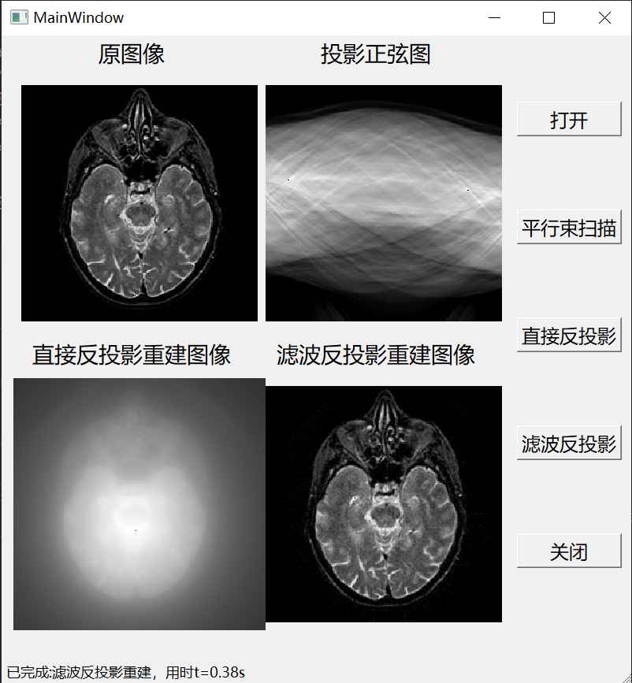

# BI909 生物医学图像处理（2）

一个基于PySide2和Numpy的CT平行束扫描和重建算法的可视化实现。

## Requirements
> [requirements.txt](requirements.txt)

## Run
生成数据
> python [generate_data.py](generate_data.py)

运行主程序
> python [main.py](main.py)

生成可视化结果
> python [visualize.py](visualize.py)